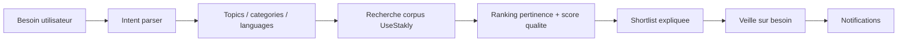

# UseStakly — Plan d'action : recherche par besoin + veille d'intention

> Version : 0.1 — 2026-04-29
> **Statut (2026-05-03)** : Lots 1, 2, 3 (hors notifs), 5 livrés sur `main`. Lot 3 notifications + Lot 4 MCP cohérent restent ouverts. Reste consolidé dans `docs/plans/remaining-work-2026-05-03.md`.
>
> **Livré** :
> - Lot 1 : `services/recommendations.rs` (754 l, parser intent + ranking + `parse_intent`/`recommend_for_use_case`), endpoint `POST /api/use-cases/recommend` (handler `use_cases.rs`).
> - Lot 2 : `frontend/src/features/repos/components/UseCaseSearchPanel.tsx` (241 l) intégré sur `/discover`, intention détectée + shortlist expliquée + CTA "créer veille".
> - Lot 3 (partiel) : migrations 0020 (`use_case_queries`, `use_case_watches`, `use_case_watch_matches`), endpoints `GET/POST /api/use-cases/watch`, sous-section `Besoins` dans `/watchlist`. **Notifications non câblées** (`use_case_new_candidate` / `use_case_quality_drop` / `use_case_flag_added` / `use_case_best_candidate_changed` jamais émis ; le scheduler `services/scheduler.rs` ne traite pas les `use_case_watches`).
> - Lot 5 : `scripts/seed-public-corpus.ps1` réorganisé par familles (UI kits, ORM, Auth, Validation, HTTP, Testing, video, etc.).
>
> **Reste** :
> - Lot 3 notifications : étendre `services/scheduler.rs` pour réévaluer les watches actives, comparer avec `use_case_watch_matches`, émettre les 4 types de notifications via `services/notifications.rs`.
> - Lot 4 MCP : faire consommer au tool `recommend_github_repos` le même service que l'API HTTP (intent+categories+topics + provenance), ou ajouter un tool `watch_use_case` séparé.
>
> Objectif : transformer UseStakly de "je connais un repo, est-il fiable ?" vers "j'ai un besoin, quels outils OSS fiables dois-je regarder et surveiller ?"

## Pourquoi

UseStakly possede deja trois briques fortes :

- un corpus GitHub OSS avec score qualite ;
- une watchlist repo ;
- un MCP capable de recommander des repos.

La prochaine evolution coherente est de permettre a un utilisateur de partir d'un besoin naturel :

```text
Je cherche un outil pour faire des videos de formation.
Je cherche un ORM TypeScript fiable.
Je cherche une lib React table maintenue.
```

UseStakly doit convertir ce besoin en shortlist expliquee, puis permettre de creer une veille sur l'intention, pas seulement sur un repo.

## Principe produit

Le produit ne doit pas devenir une simple recherche GitHub bis.

UseStakly doit repondre avec :

- l'intention comprise ;
- les categories pertinentes ;
- les repos candidats deja presents dans le corpus ;
- le score qualite et sa provenance ;
- les limites de confiance ;
- un bouton pour surveiller ce besoin dans le temps.

Exemple attendu :

```text
Besoin detecte : creation video pedagogique

Categories :
- capture ecran
- montage video
- generation video par code
- animation pedagogique
- traitement / compression

Recommendations :
1. remotion-dev/remotion
2. obsproject/obs-studio
3. manimcommunity/manim
4. ffmpeg/ffmpeg
5. mifi/lossless-cut

Action :
Creer une veille "outils OSS pour videos de formation"
```

## MVP recommande

Le MVP doit rester explicable et robuste. Pas besoin d'ajouter un LLM au debut.

### Scope MVP

- Recherche texte libre dans Discover.
- Normalisation deterministe vers topics/categories/langages.
- Recherche dans le corpus UseStakly uniquement.
- Ranking par score UseStakly v2 + pertinence lexicale/topics.
- Shortlist expliquee.
- Creation d'une veille sur la requete.
- Notification simple quand un repo lie a cette veille change fortement de score.

### Hors scope MVP

- Crawl GitHub global a chaque requete.
- LLM obligatoire.
- Index web externe.
- Marketplace de categories manuelle complexe.
- Email digest.
- Recherche multi-ecosystemes hors GitHub.

## Modele mental



## Donnees

### Table `use_case_queries`

Stocke une intention sauvegardee ou analysee.

Champs proposes :

- `id UUID PRIMARY KEY`
- `user_id UUID NULL REFERENCES users(id)`
- `query_text TEXT NOT NULL`
- `normalized_intent TEXT NOT NULL`
- `categories TEXT[] NOT NULL DEFAULT '{}'`
- `topics TEXT[] NOT NULL DEFAULT '{}'`
- `languages TEXT[] NOT NULL DEFAULT '{}'`
- `risk_tolerance TEXT NOT NULL DEFAULT 'medium'`
- `created_at TIMESTAMPTZ NOT NULL DEFAULT now()`

Remarque : `user_id` peut etre nullable pour permettre une recommandation anonyme sans veille persistante.

### Table `use_case_watches`

Stocke les veilles d'intention.

Champs proposes :

- `id UUID PRIMARY KEY`
- `user_id UUID NOT NULL REFERENCES users(id)`
- `use_case_query_id UUID NOT NULL REFERENCES use_case_queries(id)`
- `label TEXT NOT NULL`
- `enabled BOOLEAN NOT NULL DEFAULT true`
- `last_checked_at TIMESTAMPTZ`
- `last_notified_at TIMESTAMPTZ`
- `created_at TIMESTAMPTZ NOT NULL DEFAULT now()`

### Table optionnelle `use_case_watch_matches`

Capture les repos actuellement associes a une veille.

Champs proposes :

- `use_case_watch_id UUID NOT NULL REFERENCES use_case_watches(id)`
- `external_artifact_id UUID NOT NULL REFERENCES external_artifacts(id)`
- `match_score NUMERIC(4,3) NOT NULL`
- `quality_score NUMERIC(4,3)`
- `last_seen_at TIMESTAMPTZ NOT NULL DEFAULT now()`
- `PRIMARY KEY (use_case_watch_id, external_artifact_id)`

Cette table aide a detecter :

- nouveau repo pertinent ;
- repo qui sort du top ;
- repo dont le score baisse ;
- alternative qui depasse le choix courant.

## Backend

### Nouveau module

Ajouter un domaine dedie :

```text
backend/src/services/recommendations/
```

Responsabilites :

- parser une requete en intention ;
- mapper intention vers topics/categories/langages ;
- rechercher des repos candidats ;
- calculer un score de pertinence ;
- composer des explications produit ;
- partager la logique entre HTTP et MCP.

### Parser d'intention v1

Version deterministe basee sur dictionnaires.

Exemples de mappings :

| Mots utilisateur | Categories | Topics |
|---|---|---|
| `video`, `formation`, `course`, `tutorial` | `video-creation`, `education` | `video`, `recording`, `screen-recording`, `animation`, `ffmpeg`, `education` |
| `orm`, `database`, `postgres`, `typescript` | `database`, `orm` | `orm`, `database`, `postgresql`, `typescript`, `sql` |
| `table`, `grid`, `datatable`, `react` | `ui`, `data-grid` | `table`, `datatable`, `grid`, `react`, `typescript` |
| `auth`, `login`, `oauth`, `next` | `auth` | `auth`, `oauth`, `nextjs`, `security` |

Le parser doit renvoyer aussi `confidence` :

- `high` : mots cles clairs ;
- `medium` : quelques signaux ;
- `low` : fallback lexical seulement.

### Endpoint recommandation

```http
POST /api/use-cases/recommend
```

Body :

```json
{
  "query": "outil pour faire des videos de formation",
  "riskTolerance": "medium",
  "limit": 8
}
```

Reponse :

```json
{
  "query": "outil pour faire des videos de formation",
  "intent": {
    "label": "Creation video pedagogique",
    "confidence": "medium",
    "categories": ["video-creation", "education"],
    "topics": ["video", "recording", "animation", "ffmpeg", "education"],
    "languages": []
  },
  "recommendations": [
    {
      "artifactId": "...",
      "fullName": "remotion-dev/remotion",
      "matchScore": 0.83,
      "qualityScore": 0.74,
      "risk": "medium",
      "reason": "Bon candidat pour generer des videos par code avec React.",
      "matchedTopics": ["video", "react"],
      "quality": {
        "formulaVersion": "v2.0",
        "overall": 0.74,
        "freshness": 0.99,
        "reliability": 0.5,
        "abandonment": 0.02,
        "vitality": 0.95
      }
    }
  ],
  "fallbackCandidates": [
    "obsproject/obs-studio",
    "ffmpeg/ffmpeg"
  ]
}
```

### Endpoint creation veille

```http
POST /api/use-cases/watch
```

Authentification requise.

Body :

```json
{
  "query": "outil pour faire des videos de formation",
  "label": "Outils OSS pour videos de formation",
  "riskTolerance": "medium"
}
```

Reponse :

```json
{
  "watchId": "...",
  "label": "Outils OSS pour videos de formation",
  "initialMatches": 5
}
```

### Endpoint liste des veilles

```http
GET /api/use-cases/watch
```

Renvoie les veilles d'intention de l'utilisateur, avec les meilleurs repos actuels.

### Scheduler

Etendre le scheduler existant :

1. recompute scores ;
2. recalculer les matches des `use_case_watches` actives ;
3. emettre notifications si :
   - un nouveau repo entre dans le top N ;
   - le meilleur repo change ;
   - un repo du top baisse de score de `>= 0.10` ;
   - un repo reco prend un flag toxique ;
   - une alternative depasse le repo courant de `>= 0.08`.

## Frontend

### Discover

Ajouter une zone sobre en haut de `/discover` :

```text
Que veux-tu construire ?
[ outil pour faire des videos de formation                 ] [Rechercher]
```

Apres recherche :

- afficher l'intention detectee ;
- afficher les categories/topics appliques ;
- afficher les recommandations avec score ;
- proposer "Creer une veille sur ce besoin".

### Composants proposes

```text
frontend/src/features/repos/components/use-case-search-panel.tsx
frontend/src/features/repos/components/use-case-recommendation-list.tsx
frontend/src/lib/api/use-cases.ts
```

### Watchlist / Veille

Deux options UX :

1. Integrer les veilles d'intention dans `/watchlist`.
2. Creer un sous-onglet dans `/watchlist` :
   - `Repos`
   - `Besoins`

Recommandation : commencer par un sous-onglet dans `/watchlist`, pour ne pas creer une page supplementaire trop tot.

## MCP

Le MCP doit utiliser le meme service backend que l'API web.

### Evolution de `recommend_github_repos`

Ajouter ou renforcer :

- `need` : besoin naturel ;
- `ecosystem` ;
- `risk_tolerance` ;
- `must_have_topics` ;
- `watch_intent` optionnel plus tard.

Sortie attendue :

- shortlist ;
- explication fine ;
- score qualite ;
- provenance ;
- suggestions de candidats a ajouter au corpus si aucun resultat.

### Nouveau tool optionnel

Pas necessaire au MVP, mais utile ensuite :

```text
watch_use_case
```

Permettrait a un agent de creer une veille :

```text
Surveille les outils OSS pour video de formation et notifie-moi si une meilleure alternative apparait.
```

## Corpus

La recherche par besoin sera mauvaise si le corpus ne contient pas assez de categories.

Ajouter un corpus initial par familles :

- video / formation :
  - `remotion-dev/remotion`
  - `obsproject/obs-studio`
  - `ffmpeg/ffmpeg`
  - `manimcommunity/manim`
  - `mifi/lossless-cut`
  - `shotcut/shotcut`
- ORM TypeScript :
  - `prisma/prisma`
  - `drizzle-team/drizzle-orm`
  - `typeorm/typeorm`
  - `sequelize/sequelize`
  - `knex/knex`
- React table :
  - `TanStack/table`
  - `ag-grid/ag-grid`
  - `handsontable/handsontable`
- Auth :
  - `nextauthjs/next-auth`
  - `better-auth/better-auth`
  - `auth0/nextjs-auth0`

Action recommandee : faire evoluer `scripts/seed-public-corpus.ps1` vers un corpus categorise.

## Ranking v1

Score final recommande :

```text
recommendation_score =
  0.45 * quality_overall
  + 0.30 * topic_match
  + 0.15 * lexical_match
  + 0.10 * ecosystem_match
```

Garde-fous :

- exclure `archived=true` sauf si toggle explicite ;
- penaliser `abandonment > 0.35` ;
- penaliser flags toxiques publics ;
- en `riskTolerance=low`, imposer `quality_overall >= 0.70` ou expliquer le fallback ;
- en `riskTolerance=high`, autoriser repos plus jeunes si forte pertinence.

## Notifications

Types de notification v1 :

```text
use_case_new_candidate
use_case_best_candidate_changed
use_case_quality_drop
use_case_flag_added
```

Exemples :

```text
Une nouvelle option pertinente est apparue pour "outils OSS pour videos de formation" : remotion-dev/remotion.
```

```text
Le meilleur choix pour "ORM TypeScript fiable" est maintenant prisma/prisma selon le scoring v2.0.
```

```text
typeorm/typeorm a baisse en score dans ta veille "ORM TypeScript fiable".
```

## Etapes d'implementation

### Lot 1 — Service de recommandation par besoin

- [ ] Ajouter le module `services/recommendations`.
- [ ] Ajouter parser deterministe `query -> intent`.
- [ ] Ajouter ranking `quality + topic + lexical + ecosystem`.
- [ ] Ajouter tests unitaires sur les mappings principaux.
- [ ] Brancher `POST /api/use-cases/recommend`.

Validation :

- "ORM TypeScript fiable" retourne Prisma/Drizzle/TypeORM/Sequelize.
- "video formation" retourne les repos video si corpus seed.
- Reponse contient toujours provenance `formulaVersion`.

### Lot 2 — UX Discover

- [ ] Ajouter le champ "Que veux-tu construire ?" dans `/discover`.
- [ ] Afficher intention detectee.
- [ ] Afficher shortlist expliquee.
- [ ] Garder la filter bar actuelle pour exploration classique.
- [ ] Ajouter etats empty/loading/error.

Validation :

- recherche naturelle utilisable sur desktop/mobile ;
- aucun texte ne deborde ;
- la recherche classique Discover continue de fonctionner.

### Lot 3 — Veille d'intention

- [ ] Ajouter migrations `use_case_queries`, `use_case_watches`, optionnellement `use_case_watch_matches`.
- [ ] Ajouter `POST /api/use-cases/watch`.
- [ ] Ajouter `GET /api/use-cases/watch`.
- [ ] Ajouter sous-onglet `Besoins` dans `/watchlist`.
- [ ] Ajouter notifications v1.

Validation :

- un utilisateur connecte cree une veille depuis une recherche ;
- la veille apparait dans `/watchlist` ;
- une variation de score significative cree une notification.

### Lot 4 — MCP coherent avec le web

- [ ] Faire consommer au tool `recommend_github_repos` le meme service que l'API.
- [ ] Ajouter explications "intent/categories/topics".
- [ ] Ajouter fallback "repos candidats a ajouter au corpus".
- [ ] Documenter dans `/mcp-guide` et `docs/mcp-examples.md`.

Validation :

- Codex peut demander "recommande-moi un outil pour faire des videos de formation".
- La reponse MCP et la reponse web donnent une logique coherente.

### Lot 5 — Corpus categorise

- [ ] Convertir `scripts/seed-public-corpus.ps1` en groupes lisibles.
- [ ] Ajouter repos video/education.
- [ ] Ajouter repos devtools utiles par use case.
- [ ] Re-seed prod apres deploy backend.

Validation :

- `/discover` contient assez de candidats pour 5 a 10 besoins communs.
- Les premiers resultats ne semblent pas absurdes visuellement.

## Risques

### Risque : hallucination produit

Si UseStakly recommande hors corpus ou sans provenance claire, il perd son avantage.

Mitigation :

- MVP limite au corpus UseStakly ;
- afficher les fallback candidates comme "a ajouter au corpus", pas comme scores fiables ;
- toujours exposer `formulaVersion`.

### Risque : corpus trop petit

Une recherche par besoin peut sembler mauvaise si les bons outils ne sont pas seed.

Mitigation :

- corpus categorise ;
- fallback "ajouter ces repos au corpus" ;
- CTA "proposer un repo".

### Risque : complexite UX

Discover peut devenir confus entre recherche classique et recherche par besoin.

Mitigation :

- garder une seule entree principale "Que veux-tu construire ?";
- afficher les filtres avances comme seconde couche ;
- expliquer l'intention detectee.

### Risque : notifications bruyantes

Une veille d'intention peut generer trop de changements.

Mitigation :

- seuils stricts ;
- max une notification par veille par jour au MVP ;
- digest plus tard.

## Definition of done MVP

- Un utilisateur peut taper un besoin naturel dans Discover.
- UseStakly renvoie une shortlist de repos du corpus avec score v2.0.
- La reponse explique pourquoi chaque repo est recommande.
- Un utilisateur connecte peut creer une veille sur ce besoin.
- La veille apparait dans `/watchlist`.
- Une notification in-app est creee lorsqu'un repo important de cette veille change fortement.
- Le MCP donne une reponse coherente pour le meme besoin.

